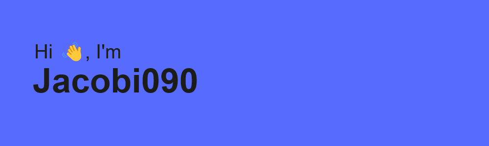

<h1 align="center">Hey 👋, I'm ThePlug09</h1>
<h3 align="center">Frontend Developer • from 🇨🇦 Canada</h3>

---

  

### 👨‍💻 About Me

- 🔭 Currently building **Forjed**
- 🌱 Learning more about **HTML, CSS, and JavaScript**
- 💬 Ask me about **frontend development** and **web design**
- 📫 Reach me on **Discord:** `ThePlug09 (theplug09._.)`  
  or via **email:** `jacobi090@proton.me`

---

### Tech Stack

  
  
  
  
  
  

---

### 📊 GitHub Stats

  
   
  

---

### 🌐 Connect with Me

  
  

---

Owner of The Forjed Project

